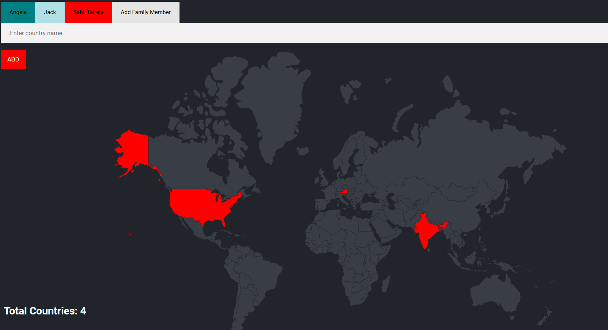

# 🌍 Travel Tracker

A simple Node.js + Express + PostgreSQL application to keep track of countries visited by each family member, with a fun interactive world map.

## 📷 Preview
 


## 📌 Features
- **Multiple Users** – Track visited countries for each family member.
- **Interactive Map** – Highlight visited countries on a world SVG map.
- **User Management** – Add new family members with their own color theme.
- **Persistent Storage** – All data stored in a PostgreSQL database.
- **Responsive UI** – Styled with CSS for desktop and mobile.

## 🛠 Tech Stack
- **Backend:** Node.js, Express
- **Database:** PostgreSQL
- **Templating:** EJS
- **Frontend:** HTML, CSS, SVG Map
- **Other:** body-parser, pg

## 📂 Project Structure
├── index.js # Main Express server
├── queries.sql # Database schema and sample data
├── views/
│ ├── index.ejs # Home page with map & country input
│ └── new.ejs # New user form
├── public/styles/
│ ├── main.css # Main styles
│ └── new.css # Styles for new user page
├── package.json


## ⚙️ Installation & Setup

1. **Clone the repository**
   ```bash
   git clone https://github.com/yourusername/travel-tracker.git
   cd travel-tracker
   
2. Install dependencies
      npm install
   
3. Setup PostgreSQL database

    Create a database (e.g., world).

   Run the SQL commands from queries.sql to set up tables and sample data.

    Update your DB credentials in index.js:

      js

 const db = new pg.Client({
   user: "postgres",
   host: "localhost",
   database: "world",
   password: "yourpassword",
   port: 5432,
  });

4.Start the server

bash

node index.js

🚀 Usage
-> Select a user to view their visited countries.

-> Add a country using the input field.

-> Add a new user via the “Add Family Member” option.

-> The map will highlight visited countries in the user's chosen color.
